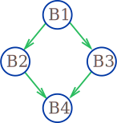
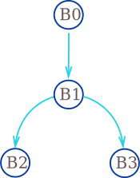
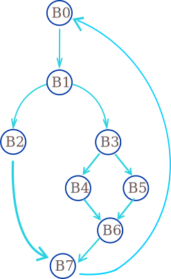
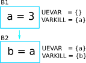
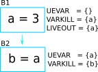
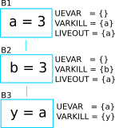

# 1. CFG
## 1.1. Table of Content

<!-- TOC -->

- [1. CFG](#1-cfg)
    - [1.1. Table of Content](#11-table-of-content)
    - [1.2. Basic blocks](#12-basic-blocks)
        - [1.2.1. Introduction to Control Flow Graph (CFG) and Basic Blocks](#121-introduction-to-control-flow-graph-cfg-and-basic-blocks)
        - [1.2.2. Transforming SSA to CFG](#122-transforming-ssa-to-cfg)
    - [1.3. Revisiting SSA](#13-revisiting-ssa)
    - [1.4. Minimal SSA](#14-minimal-ssa)
        - [1.4.1. Terminology](#141-terminology)
        - [1.4.2. Dominance](#142-dominance)
            - [1.4.2.1. Introduction](#1421-introduction)
            - [1.4.2.2. Algorithm](#1422-algorithm)
        - [1.4.3. Dominator Tree](#143-dominator-tree)
            - [1.4.3.1. Introduction](#1431-introduction)
            - [1.4.3.2. Algorithm](#1432-algorithm)
        - [1.4.4. Dominance Frontier](#144-dominance-frontier)
        - [1.4.5. Placing φ-Functions](#145-placing--functions)
    - [1.5. Creating a test](#15-creating-a-test)
        - [1.5.1. Generate test inputs](#151-generate-test-inputs)
        - [1.5.2. Asserting test output](#152-asserting-test-output)
    - [1.6. Live Variable Analysis](#16-live-variable-analysis)
        - [1.6.1. Uses for Live Variables](#161-uses-for-live-variables)
            - [1.6.1.1. Improve SSA construction](#1611-improve-ssa-construction)
            - [1.6.1.2. Finding uninitialized variables](#1612-finding-uninitialized-variables)
            - [1.6.1.3. Dead code elimination](#1613-dead-code-elimination)
        - [1.6.2. Terminology](#162-terminology)
        - [1.6.3. The basic concept of Live Variable Analysis](#163-the-basic-concept-of-live-variable-analysis)
            - [1.6.3.1. UEVAR and VARKILL](#1631-uevar-and-varkill)
            - [1.6.3.2. LIVEOUT](#1632-liveout)
        - [1.6.4. The algorithm for computing live variable](#164-the-algorithm-for-computing-live-variable)
        - [1.6.5. Testing for Live Variable Analysis](#165-testing-for-live-variable-analysis)
    - [1.7. References](#17-references)

<!-- /TOC -->
## 1.2. Basic blocks

### 1.2.1. Introduction to Control Flow Graph (CFG) and Basic Blocks
Basic block simply means a straight-line code sequence with no branches except the entry and the exit. 

E.g., 
```python
a = x + y                       
b = x + y            
a = 17               
c = x + y 
```

The code above can be group into a block, namely `Basic Block`. 

Now take a look at the code below. 

```python
a = x + y                       
if b < 3:
    x = 0
else:
    x = 1
b = x + y
```

The code above will generate multiple basic blocks since it has a branching statement. The basic blocks will then linked between themselves, and form a network of basic blocks, name **Control Flow Graph (CFG)**. 


### 1.2.2. Transforming SSA to CFG

Transforming SSA to CFG (multiple basic blocks) will required a recursive algorithm, since the program could be nested branch statement. For example, 

```python
x = a + b
if x < 2:
    if a < 2:
        a = 2
else:
    a = 3
```

The recursive function will require returning the head basic block and the tail basic block to the caller. The caller can then use the head and tail return to connects both of the blocks. I.e., in *If* statement, the caller will pass the body of If to the recursive function, and will connect itself with the head returned, and connects the tail to the next basic block. At the end of the operation, it will return the head and tail for the list of ast statement. 

## 1.3. Revisiting SSA
Static single assignment(SSA) had been discussed previously on [problems when redefining occurs](https://github.com/usagitoneko97/python-ast/tree/master/A3.LVN#114-details-and-solution-for-problems-when-redefining-occurs). SSA helped to solve that particular problem. To recall, to solve the problem, the code had transformed to SSA form.

```python
a = x + y                       
b = x + y            
a = 17               
c = x + y 
```

will transform to:
```python
a_0 = x_0 + y_0                       
b_0 = x_0 + y_0            
a_1 = 17               
c_0 = x_0 + y_0 
```

And will obtain:

```python
a_0 = x_0 + y_0                       
b_0 = a_0
a_1 = 17               
c_0 = a_0
```

Transforming the code above to SSA is primarily a simple matter of replacing the target of each assignment with a new variable and with a new version.

Now consider the code below:

```python
a = x + y                       
if b < 3:
    x = 0
else:
    x = 1
b = x + y
```


To transform a CFG, especially a branching of basic blocks, to SSA form is not as straightforward as above. The code below will demonstrate the problem. 

```python
a_0 = x_0 + y_0                       
if b_0 < 3:
    x_1 = 0
else:
    x_2 = 1
b_0 = x_? + y_0
```

At the last statement of the code, the use of `x` could be referring to either `x_1` or `x_2` depending on the execution to fall into one of the 2 blocks. To resolve this, a special statement is inserted before the last statement, called a **Φ (Phi) function**. This statement will generate a new definition of `x` called `x_3` by "choosing" either `x_1` or `x_2`. 

```python
a_0 = x_0 + y_0                       
if b_0 < 3:
    x_1 = 0
else:
    x_2 = 1
x_3 = Φ(x_1, x_2)
b_0 = x_3 + y_0
```


## 1.4. Minimal SSA 

There are many ways to insert Φ-function. The easiest way of inserting Φ-function is to insert it at every block that have joint points (multiple parents). But that could result in an excess amount of unnecessaries φ-function. Consider the CFG below: 


 Φ-function of `x` had to be inserted just before `B4` since it has been declared in both of the blocks `B2` and `B3`. But φ-function for variable `y` should not be inserted at `B4` since `B2` and `B3` had not declared variable `y`.


Minimal SSA basically means the SSA form that contains the minimum Φ-function. To complete the job of minimal SSA, they are a few of additional tree structures and algorithm that are required. The section here will explain all the algorithm that is required to compute a minimal SSA. 

### 1.4.1. Terminology

- **Dominate** - A node `u` is said to *dominate* a node w w.r.t
source vertex `s` if all the paths from `s` to `w` in the graph must pass through
node u.

- **Immediate Dominator** - A node `u` is said to be an *immediate dominator*
of a node `w` (denoted as `idom(w)`) if `u` dominates `w` and every other
dominator of `w` dominates `u`.

- **Strictly Dominates** - A node `d` is said to *strictly dominates* node `n` if `d` dominates `n` and `d` does not equal `n`

- **dominance frontier** - The *dominance frontier* of a node `d` is the set of all nodes `n` such that d dominates an immediate predecessor of `n`, but `d` does not strictly dominate `n`.

- **dominator tree** - A *dominator tree* is a tree where each node's children are those nodes it immediately dominates. Because the immediate dominator is unique, it is a tree. The start node is the root of the tree.


### 1.4.2. Dominance

#### 1.4.2.1. Introduction

As stated in terminology section above, a node `u` is said to *dominate* a node `w` w.r.t the source vertex `s` if all the paths from `s` to `w` in the graph must pass through node `u`. Take for example the graph below, Assume the source is `B1`:




To find the dominated nodes of `B1`, each node reachable from `B1` is visited. Let's start with `B2`. It is clear that there is only 1 path to reach `B2` and the path must pass through `B1`. So `B2` is one of the dominated nodes of `B1`. The same applies to `B3`. For `B4`, there are 2 paths and both have to pass through `B1` as well. So `B4` is also the dominated node of `B1`.   

To find the dominated nodes of `B2`, the same process is applied. Note however, `B1` is not reachable from `B2`, so it cannot be dominated by the latter. For `B4`, there are 2 paths, namely, `B1->B2->B4` and `B1->B3->B4`. The second path does not pass through `B2` and therefore `B2` does not **dominate** `B4`. As the result `B2` does not dominate any node.

`B3` is similar to `B2`. It does not dominate any node too.

`B4` does not have any outgoing link, so there is no node reachable from it, hence it does not dominate any node.

So, the dominator tree becomes:


#### 1.4.2.2. Algorithm

They are a few ways to calculate the dominance relationship between nodes. One of the easiest ways is, for each node `w`, remove the node from the graph and perform a [DFS](https://en.wikipedia.org/wiki/Depth-first_search) from source node and all the nodes that are not visited by DFS are the nodes that dominated by `w`. 

### 1.4.3. Dominator Tree

#### 1.4.3.1. Introduction
Given a node n in a flow graph, the set of nodes that strictly dominate `n` is given by `(Dom(n) − n)`. The node in that set that is closest to n is called n’s **Immediate Dominator(IDOM)**. To simplify the relationship of IDOM and DOM, a dominator tree is built. If `m` is `IDOM(n)`, then the dominator tree has an edge from `m` to `n`. The dominator tree for example in the section above is shown below: 


#### 1.4.3.2. Algorithm

The algorithm for constructing the dominance tree is fairly simple. Consider a slightly complex dominance relationship of a tree. Assume that the source is **B0**. 


And the dominance relationship between nodes is shown below:

**B0** : [**B1**, **B2**, **B3**]

**B1** : [**B2**, **B3**]

**B2** : []

**B3** : []

To build the tree, first go down to the bottom of the tree and start to build the dominator tree from bottom to the top. For every node `u` starting from the bottom, `u` will be added to the dominator tree, and will attach node that `u` dominates and doesn't have a parent. This will result in **B0** does not have **B2** and **B3** as it's child.

The dominator tree:

  

### 1.4.4. Dominance Frontier

In a simplified manner of explanation, the dominance frontier of a node `n` can be view as, from `n`'s point of view, going through his child, DF node is the first node that `n` doesn't *strictly dominates*. For example, consider following CFG. Assume that the source is **B0**. 



Assume that DF of `B5` needs to be found, it will iterate through both of the child, `B6` and `B8`. Since `B5` dominates both of them, they are not dominance frontier of `B5`. Then it will move on to `B7`, and `B5` still dominates `B7`. On block `B3` however, `B5` does not strictly dominates `B3` hence `B3` is the dominance frontier of `B5`. 

Pseudocode for calculating DF is provided below: 

```
for each node b
    if the number of immediate predecessors of b ≥ 2
        for each p in immediate predecessors of b
            runner := p.
            while runner ≠ idom(b)
                add b to runner’s dominance frontier set
                runner := idom(runner)
```

### 1.4.5. Placing φ-Functions
With dominance frontier, the φ-function can be now place strategically. But in order to further minimize the number of φ-function, liva variable analysis can be use to find out whether the φ-function for that particular variable is needed or not.

## 1.5. Creating a test
Section here will discuss on how to create a test fixture and ways to assert it. 

### 1.5.1. Generate test inputs

In this moments, there are 2 types of test input. The first type is an AST type. AST is the actual input of the CFG class and can be build like this:

```python
import ast
as_tree = ast.parse(ms("""\
            a = 3           # 1st
            if a > 3:       #  |
                a = E       # 2nd
            else:           # 3rd
                z = F       #  |
            y = F           # Eth
            """)
                            )
cfg_real = Cfg(as_tree)
```
AST can be used in testing the building of basic block, but when comes down to testing the dominator tree or the DF, it's very hard to construct a complex linkage of basic block. Therefore the test file provide also the method for building a complex basic block. 

```python
"""
                Note: '|' with no arrows means pointing down

                 A                   
               /   \                 
              B     C         
               \   /                 
                 D                   
"""
blocks = self.build_blocks_arb(block_links={'A': ['B', 'C'], 'B': ['D'], 'C': ['D'], 'D': []})
```

Note that by default, it will create the number of blocks depending on the number of entry of the *block_links* dictionary, and the default name of basic blocks will start from `A` and incremented by 1 ascii character. 

### 1.5.2. Asserting test output
The test file `test_dominator.py` had included several assert method. 

*To assert the dominance relationship*
```python
self.assertDominatorEqual(cfg_real, {'A': ['B', 'C', 'D'],
                                     'B': [],
                                     'C': [],
                                     'D': []})
```

*To assert 2 lists of basic blocks* :
```python
expected_blocks_list = self.build_blocks_arb(block_links={'A': ['B'], 'B': ['A']})

self.assertBasicBlockListEqual(real_blocks_list, expected_blocks)
```

*To assert the DF of the blocks* :
```python
self.assertDfEqual(cfg_real, {'A': [], 'B': ['B'], 'C': ['F'], 'D': ['E'],
                              'E': ['F'], 'F': ['B']})
```

## 1.6. Live Variable Analysis

Live variable analysis perform the analysis of lifespan of variables, that is, the variables that may live out of the block, or variables that may be potentially read before their next write, or variable that may get killed in a basic blocks. 

### 1.6.1. Uses for Live Variables

#### 1.6.1.1. Improve SSA construction
To build minimal SSA, dominance frontier is used to find the strategic place to place phi functions. But dominance frontier only considers the structure of the control flow graph without taking into account of variables. Consider following diagrams. 

<!---
```
a_0 = b_0 + c_0
d_0 = 5
if a_0 < 3:
    d_0 = 4
// phi function for d here?
```
-->


In the code shown above, does a phi function needed at the last block? Even though in the analysis of dominance frontier has suggested that a definition of the variable inside block 2 will result in phi function being placed in the last block, but because of variable `d` has no use at the last block, the phi function is **not** needed. Live variable analysis will provide the information needed to further narrow the set of φ-functions. 

#### 1.6.1.2. Finding uninitialized variables

If a statement uses some variable, *v* before *v* has been assigned a value, the variable *v* can be said is an uninitialized variable. The algorithm can deduce from the set of liveness properties of a variable to determine the variable is live out from other blocks to current blocks. 

#### 1.6.1.3. Dead code elimination

A store operation like `a = b + c` is not needed if `a` is not used anywhere throughout code after the definition, or `a` **does not live out** of the block. 

### 1.6.2. Terminology

- **UEVAR** - those variables that are used in the current block before any redefinition in the current block.
- **VARKILL** - contains all the variables that are defined in current block
- **LIVEOUT** - contains all the variables that are live on exit from the block
- **BlockSets** - contains the information on where the variable is being defined. 
- **Globals** - sets of variable that are live across multiple blocks
- **Worklist(x)** - worklist of variable `x` contains all the block that defined `x`. 

### 1.6.3. The basic concept of Live Variable Analysis

#### 1.6.3.1. UEVAR and VARKILL
The concept of Uevar and Varkill is simple. Consider the following code.

```python
b = 3
a = b + c
```

| Uevar   |  varkill   |
| :---:   |  :---:     |
|   'c'   |     'b', 'a'|

The Uevar and Varkill of the blocks above are very straightforward. The variable `c` is being referenced but there is no definition of that variable in the block, thus `c` is the **Uevar** of that particular block. But `b` is not even though it is being referenced since the definition of `b` exist in the block. The **Varkill** of that block is `b` and `a`. 

#### 1.6.3.2. LIVEOUT
**Liveout** set of a particular block will contain variables that will live on exit from that block. The formal definition of Liveout is shown below. 


Basically, the equation can be broken down to 2 parts, **Uevar(m)**, and **(Liveout(m) ∩ ~Varkill(m))**. To simplify the explanation, consider the following example. 



It is obvious that the variable `a` in **B2** is required from the parents of that block, specifically **B1** in this case, hence the `a` is included in  **Uevar**. Therefore **Liveout** of **B1** has to include `a` since it is live outside of the block. To simplify,  *Liveout of the current block has to include the union of all Uevar of the successor/child blocks.*, as described in the first part of the equation. 



To describe and explain the second part of the equation, consider following example. 


The variable `a` in block **B3** is required since `a` is in the set of **UEVAR**. The variable `a` is, however, not coming from the block **B2**, but from block **B1**. So the variable `a` has to be pass from block **B1** to **B3**. Hence *Liveout(B1) += Liveout(B2)*, and Liveout(B2) = 'a'. The algorithm for computing is called fixed-point iterative method and is discussed in the section below. 




But it's not always the liveout of the child block is the liveout of the current block. From the example below: 


The variable `a` from block **B3** will be refer to `a` in block **B2** but not **B1** since `a` is being redefined in block **B2**. With that being said, the final form of the equation for the second part will be:

*Liveout of the current block has to include the union of all Liveout of the successor/child blocks and not killed by the successor/child blocks.*

```
v ∈ LiveOut(m) ∩ ~VarKill(m).
```
 
### 1.6.4. The algorithm for computing live variable

The algorithm for computing UEVar and VarKILL is very straightforward. For every statement that can be represented in the form of x = y + z, the algorithm checks if the variable `y` and `z` do not exist in the VarKILL set, then add them in the UEVar set. Variable `x` will be added in VarKILL set. 

```
// assume block b has k operations
// of form ‘‘x ← y op z’’
for each block b
    Init(b)

Init(b)
UEVar(b) ← ∅
VarKill(b) ← ∅
for i ← 1 to k   //for every operation in this block
if y ∉ VarKill(b)
    then add y to UEVar(b)
if z ∉ VarKill(b)
    then add z to UEVar(b)
add x to VarKill(b)
```

For computing Liveout, however, needed an iterative fixed-point method. Using back the example previously, 


On the first iteration, all the liveout is initialized to empty. Liveout of block **B1** is empty since **B2** doesn't have any UEVar. It will need the second iteration to update the Liveout of **B2**, only then, the liveout of **B1** will update to include variable `a`. 

The algorithm is given below:
```
// assume CFG has N blocks
// numbered 0 to N - 1
for i ← 0 to N - 1
    LiveOut( i ) ← ∅
changed ← true
while (changed)
    changed ← false
    for i ← 0 to N - 1
        recompute LiveOut( i )
        if LiveOut( i ) changed then
            changed ← true
```

Where `recompute LIVEOUT` is simply solving the equation. 


Where `succ(n)` means **successors/child** of block `n`. 

### 1.6.5. Testing for Live Variable Analysis
**Note**: In file `test_live_variable.py`. 

 The first type is an AST type. AST is the actual input of the CFG class and can be built like this:

```python
import ast
as_tree = ast.parse(ms("""\
            a = 3           # 1st
            if a > 3:       #  |
                a = 3       # 2nd
            else:           # 3rd
                z = 4       #  |
            y = 4           # 4th
            """)
                            )
cfg_real = Cfg(as_tree)
```

the following method will build a more complex structure of basic blocks with code associate to them. After it has been built, the Cfg object needed to create and assign the parameters returned by `build_blocks_arb` to respective attributes. 

```python
"""
        Note: '|' with no arrows means pointing down

          A
        /   \
       B     C
        \   /
          D
"""
blocks, \
as_tree = th.build_blocks_arb(block_links={'A': ['B', 'C'], 'B': ['D'], 'C': ['D'], 'D': []},
                              code={'A': ms("""\
                                         temp = a + b
                                         """),
                                    'B': ms("""\
                                         temp_1 = 34
                                         """),
                                    'C': ms("""\
                                         if a < 3:
                                             pass
                                         """),
                                    'D': ms("""\
                                         temp = a + b
                                         """)
                                    })
as_tree = ast.parse(ast_string)
cfg_real = Cfg()
cfg_real.block_list = blocks
cfg_real.as_tree = as_tree
cfg_real.root = cfg_real.block_list[0]                                   
```

To gather the initial information (UEVAR, VARKILL), use:
```python
cfg_real.gather_initial_info()
```

And to assert it, the helper function in that test file can be used:
```python
expected_ue_var = ({'c'}, {'a', 'b'})
expected_var_kill = ({'a'}, {'y', 'x'})
self.assertUeVarKill(cfg_real.block_list, expected_ue_var, expected_var_kill)
```

To fill the liveout of all the blocks:
```python
cfg_real.compute_live_out()
```

To assert only the liveout, use:
```python
expected_live_out = {'A': {'s', 'i'}, 'B': {'s', 'i'}, 'C': {'s', 'i'},
                     'D': {'s', 'i'}, 'E': set()}

self.assertLiveOutEqual(cfg_real.block_list, expected_live_out)
```

## 1.7. References
- Torczon, L. and Cooper, M. ed., (2012). Ch9 - Data-Flow Analysis. In: Engineering a compiler, 2nd ed. Texas: Elsevier, Inc, pp.495-519.
- Torczon, L. and Cooper, M. ed., (2012). Ch8 - Introduction to optimization. In: Engineering a compiler, 2nd ed. Texas: Elsevier, Inc, pp.445-457.
- Braun, M., Buchwald, S., Hack, S., Leißa, R., Mallon, C., & Zwinkau, A. (2013). Simple and efficient construction of static single assignment form. Lecture Notes in Computer Science (Including Subseries Lecture Notes in Artificial Intelligence and Lecture Notes in Bioinformatics), 7791 LNCS(March), 102–122. https://doi.org/10.1007/978-3-642-37051-9_6
- Cytron, R., Ferrante, J., Rosen, B. K., Wegman, M. N., & Zadeck, F. K. (1991). Efficiently computing static single assignment form and the control dependence graph. ACM Transactions on Programming Languages and Systems, 13(4), 451–490. https://doi.org/10.1145/115372.115320