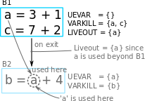
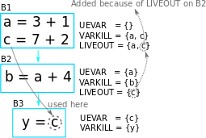
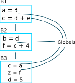
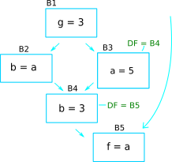
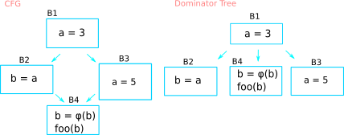

# 1. CFG
## 1.1. Table of Content

<!-- TOC -->

- [1. CFG](#1-cfg)
    - [1.1. Table of Content](#11-table-of-content)
    - [1.2. Basic blocks](#12-basic-blocks)
        - [1.2.1. Introduction to Control Flow Graph (CFG) and Basic Blocks](#121-introduction-to-control-flow-graph-cfg-and-basic-blocks)
        - [1.2.2. Transforming SSA to CFG](#122-transforming-ssa-to-cfg)
    - [1.3. Revisiting SSA](#13-revisiting-ssa)
    - [1.4. Minimal SSA](#14-minimal-ssa)
        - [1.4.1. Terminology](#141-terminology)
        - [1.4.2. Dominance](#142-dominance)
            - [1.4.2.1. Introduction](#1421-introduction)
            - [1.4.2.2. Algorithm](#1422-algorithm)
        - [1.4.3. Dominator Tree](#143-dominator-tree)
            - [1.4.3.1. Introduction](#1431-introduction)
            - [1.4.3.2. Algorithm](#1432-algorithm)
        - [1.4.4. Dominance Frontier](#144-dominance-frontier)
        - [1.4.5. Placing φ-Functions](#145-placing-%CF%86-functions)
    - [1.5. Creating a test](#15-creating-a-test)
        - [1.5.1. Generate test inputs](#151-generate-test-inputs)
        - [1.5.2. Asserting test output](#152-asserting-test-output)
    - [1.6. Live Variable Analysis](#16-live-variable-analysis)
        - [1.6.1. Uses for Live Variables](#161-uses-for-live-variables)
            - [1.6.1.1. Improve SSA construction](#1611-improve-ssa-construction)
            - [1.6.1.2. Finding uninitialized variables](#1612-finding-uninitialized-variables)
            - [1.6.1.3. Dead code elimination](#1613-dead-code-elimination)
        - [1.6.2. Terminology](#162-terminology)
        - [1.6.3. The basic concept of Live Variable Analysis](#163-the-basic-concept-of-live-variable-analysis)
            - [1.6.3.1. UEVAR and VARKILL](#1631-uevar-and-varkill)
            - [1.6.3.2. LIVEOUT](#1632-liveout)
        - [1.6.4. The algorithm for computing live variable](#164-the-algorithm-for-computing-live-variable)
        - [1.6.5. Testing for Live Variable Analysis](#165-testing-for-live-variable-analysis)
    - [1.7. Insertion of φ-function](#17-insertion-of-%CF%86-function)
        - [1.7.1. Trivial SSA](#171-trivial-ssa)
        - [1.7.2. Minimal SSA](#172-minimal-ssa)
        - [1.7.3. Pruning SSA](#173-pruning-ssa)
            - [1.7.3.1. Semipruned SSA](#1731-semipruned-ssa)
            - [1.7.3.2. Pruned SSA](#1732-pruned-ssa)
        - [1.7.4. Worklist algorithm for inserting φ-function.](#174-worklist-algorithm-for-inserting-%CF%86-function)
            - [1.7.4.1. Basic concept](#1741-basic-concept)
            - [1.7.4.2. The algorithm](#1742-the-algorithm)
    - [1.8. Renaming of SSA](#18-renaming-of-ssa)
        - [1.8.1. Role of stack and counter](#181-role-of-stack-and-counter)
        - [1.8.2. The algorithm](#182-the-algorithm)
        - [1.8.3. Why dominator tree?](#183-why-dominator-tree)
        - [1.8.4. Testing for complete SSA generation](#184-testing-for-complete-ssa-generation)
    - [1.9. References](#19-references)

<!-- /TOC -->
## 1.2. Basic blocks

### 1.2.1. Introduction to Control Flow Graph (CFG) and Basic Blocks
Basic block simply means a straight-line code sequence with no branches except the entry and the exit. 

E.g., 
```python
a = x + y                       
b = x + y            
a = 17               
c = x + y 
```

The code above can be group into a block, namely `Basic Block`. 

Now take a look at the code below. 

```python
a = x + y                       
if b < 3:
    x = 0
else:
    x = 1
b = x + y
```

The code above will generate multiple basic blocks since it has a branching statement. The basic blocks will then linked between themselves, and form a network of basic blocks, name **Control Flow Graph (CFG)**. 


### 1.2.2. Transforming SSA to CFG

Transforming SSA to CFG (multiple basic blocks) will required a recursive algorithm, since the program could be nested branch statement. For example, 

```python
x = a + b
if x < 2:
    if a < 2:
        a = 2
else:
    a = 3
```

The recursive function will require returning the head basic block and the tail basic block to the caller. The caller can then use the head and tail return to connects both of the blocks. I.e., in *If* statement, the caller will pass the body of If to the recursive function, and will connect itself with the head returned, and connects the tail to the next basic block. At the end of the operation, it will return the head and tail for the list of ast statement. 

## 1.3. Revisiting SSA
Static single assignment(SSA) had been discussed previously on [problems when redefining occurs](https://github.com/usagitoneko97/python-ast/tree/master/A3.LVN#114-details-and-solution-for-problems-when-redefining-occurs). SSA helped to solve that particular problem. To recall, to solve the problem, the code had transformed to SSA form.

```python
a = x + y                       
b = x + y            
a = 17               
c = x + y 
```

will transform to:
```python
a_0 = x_0 + y_0                       
b_0 = x_0 + y_0            
a_1 = 17               
c_0 = x_0 + y_0 
```

And will obtain:

```python
a_0 = x_0 + y_0                       
b_0 = a_0
a_1 = 17               
c_0 = a_0
```

Transforming the code above to SSA is primarily a simple matter of replacing the target of each assignment with a new variable and with a new version.

Now consider the code below:

```python
a = x + y                       
if b < 3:
    x = 0
else:
    x = 1
b = x + y
```


To transform a CFG, especially a branching of basic blocks, to SSA form is not as straightforward as above. The code below will demonstrate the problem. 

```python
a_0 = x_0 + y_0                       
if b_0 < 3:
    x_1 = 0
else:
    x_2 = 1
b_0 = x_? + y_0
```

At the last statement of the code, the use of `x` could be referring to either `x_1` or `x_2` depending on the execution to fall into one of the 2 blocks. To resolve this, a special statement is inserted before the last statement, called a **Φ (Phi) function**. This statement will generate a new definition of `x` called `x_3` by "choosing" either `x_1` or `x_2`. 

```python
a_0 = x_0 + y_0                       
if b_0 < 3:
    x_1 = 0
else:
    x_2 = 1
x_3 = Φ(x_1, x_2)
b_0 = x_3 + y_0
```


## 1.4. Minimal SSA 

There are many ways to insert Φ-function. The easiest way of inserting Φ-function is to insert it at every block that have joint points (multiple parents). But that could result in an excess amount of unnecessaries φ-function. Consider the CFG below: 


 Φ-function of `x` had to be inserted just before `B4` since it has been declared in both of the blocks `B2` and `B3`. But φ-function for variable `y` should not be inserted at `B4` since `B2` and `B3` had not declared variable `y`.


Minimal SSA basically means the SSA form that contains the minimum Φ-function. To complete the job of minimal SSA, they are a few of additional tree structures and algorithm that are required. The section here will explain all the algorithm that is required to compute a minimal SSA. 

### 1.4.1. Terminology

- **Dominate** - A node `u` is said to *dominate* a node w w.r.t
source vertex `s` if all the paths from `s` to `w` in the graph must pass through
node u.

- **Immediate Dominator** - A node `u` is said to be an *immediate dominator*
of a node `w` (denoted as `idom(w)`) if `u` dominates `w` and every other
dominator of `w` dominates `u`.

- **Strictly Dominates** - A node `d` is said to *strictly dominates* node `n` if `d` dominates `n` and `d` does not equal `n`

- **dominance frontier** - The *dominance frontier* of a node `d` is the set of all nodes `n` such that d dominates an immediate predecessor of `n`, but `d` does not strictly dominate `n`.

- **dominator tree** - A *dominator tree* is a tree where each node's children are those nodes it immediately dominates. Because the immediate dominator is unique, it is a tree. The start node is the root of the tree.


### 1.4.2. Dominance

#### 1.4.2.1. Introduction

As stated in terminology section above, a node `u` is said to *dominate* a node `w` w.r.t the source vertex `s` if all the paths from `s` to `w` in the graph must pass through node `u`. Take for example the graph below, Assume the source is `B1`:


To find the dominated nodes of `B1`, each node reachable from `B1` is visited. Let's start with `B2`. It is clear that there is only 1 path to reach `B2` and the path must pass through `B1`. So `B2` is one of the dominated nodes of `B1`. The same applies to `B3`. For `B4`, there are 2 paths and both have to pass through `B1` as well. So `B4` is also the dominated node of `B1`.   

To find the dominated nodes of `B2`, the same process is applied. Note however, `B1` is not reachable from `B2`, so it cannot be dominated by the latter. For `B4`, there are 2 paths, namely, `B1->B2->B4` and `B1->B3->B4`. The second path does not pass through `B2` and therefore `B2` does not **dominate** `B4`. As the result `B2` does not dominate any node.

`B3` is similar to `B2`. It does not dominate any node too.

`B4` does not have any outgoing link, so there is no node reachable from it, hence it does not dominate any node.

So, the dominator tree becomes:


#### 1.4.2.2. Algorithm

They are a few ways to calculate the dominance relationship between nodes. One of the easiest ways is, for each node `w`, remove the node from the graph and perform a [DFS](https://en.wikipedia.org/wiki/Depth-first_search) from source node and all the nodes that are not visited by DFS are the nodes that dominated by `w`. 

### 1.4.3. Dominator Tree

#### 1.4.3.1. Introduction
Given a node n in a flow graph, the set of nodes that strictly dominate `n` is given by `(Dom(n) − n)`. The node in that set that is closest to n is called n’s **Immediate Dominator(IDOM)**. To simplify the relationship of IDOM and DOM, a dominator tree is built. If `m` is `IDOM(n)`, then the dominator tree has an edge from `m` to `n`. The dominator tree for example in the section above is shown below: 


#### 1.4.3.2. Algorithm

The algorithm for constructing the dominance tree is fairly simple. Consider a slightly complex dominance relationship of a tree. Assume that the source is **B0**. 


And the dominance relationship between nodes is shown below:

**B0** : [**B1**, **B2**, **B3**]

**B1** : [**B2**, **B3**]

**B2** : []

**B3** : []

To build the tree, first go down to the bottom of the tree and start to build the dominator tree from bottom to the top. For every node `u` starting from the bottom, `u` will be added to the dominator tree, and will attach node that `u` dominates and doesn't have a parent. This will result in **B0** does not have **B2** and **B3** as it's child.

The dominator tree:

  

### 1.4.4. Dominance Frontier

In a simplified manner of explanation, the dominance frontier of a node `n` can be view as, from `n`'s point of view, going through his child, DF node is the first node that `n` doesn't *strictly dominates*. For example, consider following CFG. Assume that the source is **B0**. 


Assume that DF of `B5` needs to be found, it will iterate through both of the child, `B6` and `B8`. Since `B5` dominates both of them, they are not dominance frontier of `B5`. Then it will move on to `B7`, and `B5` still dominates `B7`. On block `B3` however, `B5` does not strictly dominates `B3` hence `B3` is the dominance frontier of `B5`. 

Pseudocode for calculating DF is provided below: 

```
for each node b
    if the number of immediate predecessors of b ≥ 2
        for each p in immediate predecessors of b
            runner := p.
            while runner ≠ idom(b)
                add b to runner’s dominance frontier set
                runner := idom(runner)
```

### 1.4.5. Placing φ-Functions
With dominance frontier, the φ-function can be now place strategically. But in order to further minimize the number of φ-function, liva variable analysis can be use to find out whether the φ-function for that particular variable is needed or not.

## 1.5. Creating a test
Section here will discuss on how to create a test fixture and ways to assert it. 

### 1.5.1. Generate test inputs

In this moments, there are 2 types of test input. The first type is an AST type. AST is the actual input of the CFG class and can be build like this:

```python
import ast
as_tree = ast.parse(ms("""\
            a = 3           # 1st
            if a > 3:       #  |
                a = E       # 2nd
            else:           # 3rd
                z = F       #  |
            y = F           # Eth
            """)
                            )
cfg_real = Cfg(as_tree)
```
AST can be used in testing the building of basic block, but when comes down to testing the dominator tree or the DF, it's very hard to construct a complex linkage of basic block. Therefore the test file provide also the method for building a complex basic block. 

```python
"""
                Note: '|' with no arrows means pointing down

                 A                   
               /   \                 
              B     C         
               \   /                 
                 D                   
"""
blocks = self.build_blocks_arb(block_links={'A': ['B', 'C'], 'B': ['D'], 'C': ['D'], 'D': []})
```

Note that by default, it will create the number of blocks depending on the number of entry of the *block_links* dictionary, and the default name of basic blocks will start from `A` and incremented by 1 ascii character. 

### 1.5.2. Asserting test output
The test file `test_dominator.py` had included several assert method. 

*To assert the dominance relationship*
```python
self.assertDominatorEqual(cfg_real, {'A': ['B', 'C', 'D'],
                                     'B': [],
                                     'C': [],
                                     'D': []})
```

*To assert 2 lists of basic blocks* :
```python
expected_blocks_list = self.build_blocks_arb(block_links={'A': ['B'], 'B': ['A']})

self.assertBasicBlockListEqual(real_blocks_list, expected_blocks)
```

*To assert the DF of the blocks* :
```python
self.assertDfEqual(cfg_real, {'A': [], 'B': ['B'], 'C': ['F'], 'D': ['E'],
                              'E': ['F'], 'F': ['B']})
```

## 1.6. Live Variable Analysis

 Live variable analysis will shows the lifespan of each variable across multiple blocks in a network of complex block chain, that is, the variables that may live out of the block, or variables that may be potentially read before their next write, or variable that may get killed in a basic blocks. 

### 1.6.1. Uses for Live Variables

#### 1.6.1.1. Improve SSA construction
To build minimal SSA, dominance frontier is used to find the strategic place to place φ-functions. One problem with dominance frontier is that it suggests the nodes to which φ-function(s) should be placed based on structural information (CFG) without considering the data (variables), This leads to possibly inserting redundant φ-function. Consider the following diagram: 

<!---
```
a_0 = b_0 + c_0
d_0 = 5
if a_0 < 3:
    d_0 = 4
// phi function for d here?
```
-->


In the code shown above, does a φ-function needed at block **B3**? Even though the dominance frontier suggests that the definition of the variable `d` inside block 2 will result in φ-function being inserted in the last block, but because of variable `d` not being used there, the φ-function is not needed. This is where live variable analysis assists the dominance frontier to reduce the set of φ-functions.

#### 1.6.1.2. Finding uninitialized variables

 If a statement uses some variable `v` before it has been assigned a value, then clearly it is an error missed by the programmer. If the variable is defined in the same block, then it is a trivial task to determine if the variable has been initialized. However if the variable lives across multiple blocks, then it is no more trivial and we need LVA to make that deduction. LVA is discussed in section [1.6.3]. 
 
#### 1.6.1.3. Dead code elimination

A store operation like `a = b + c` is not needed if `a` is not used beyond the code after the definition. This has some relation with LIVEOUT computation that discussed below. 

### 1.6.2. Terminology

- **UEVAR(n)** - (Upward Exposure Variable) Refers to variables that are used in the block `n` before any redefinition in the current block.
- **VARKILL(n)** - (Variable Kill) contains all the variables that are defined in block `n`
- **LIVEOUT(n)** - contains all the variables that lives on exiting block `n`
- **BlockSets(v)** - contains the information of the blocks within which the variable `v` is defined. 
- **Globals** - sets of variable that are live across multiple blocks
- **Worklist(v)** - is dynamic information of BlockSets of variable `v` that used in renaming the SSA. 
Some other terminologies related to relationship of blocks. 


- B1 is the **parent/precedence** block of B2 and B3. 
- B2 and B3 is the **children/successors** of B1. 

### 1.6.3. The basic concept of Live Variable Analysis

#### 1.6.3.1. UEVAR and VARKILL
The concept of Uevar and Varkill is simple. Consider the following block codes.


| Uevar(B1)    | Varkill(B1)       |
| :------: | :-----------: |
| 'c', 'd' | 'b', 'a', 'd' |

The Uevar(B1) and Varkill(B1) above are very straightforward. The variable `c` is being referenced but there is no definition of that variable in the block, which `c` must be coming from definition in previous blocks. This will result in `c` contained in Uevar(B1). But `b` is not, even though it is being referenced since `b` is been redefined in the block before it's being referenced. 

In the last statement of the block, variable `d` that been referenced is coming from the definition on previous block , thus `d` is added into Uevar(B1) sets. But because of `d` is being redefined as well, `d` will also added in Varkill(B1) sets.

The Varkill(B1) is `b`, `a` and `d`. 

#### 1.6.3.2. LIVEOUT
**Liveout(n)** set of variables of block `n` that live on exit of that block. The formal definition of Liveout is shown below. 


Basically, the equation can be broken down to 2 parts, **Uevar(m)**, and **(Liveout(m) ∩ ~Varkill(m))**. Consider the following example. 



It is obvious that the variable `a` used in **B2** is required from the parent, **B1**.  hence `a` is included in  **Uevar(B2)**. Therefore **Liveout** of **B1** includes `a` since it lives beyond block **B1**. In this example, only 1 child is demonstrated. However, in general,  *Liveout of the current block includes the union of all Uevar of the successor/child blocks*, as described in the first part of the equation. 

<!--[liveoutsimpleex](resources/liveoutsimpleexWlo.svg.png)-->

To explain the second part of the equation, consider the following slightly modifed code of the previous example. 



The variable `c` is required in block **B3** because it is used in the statement `y = c`, and therefore `c` is included in Uevar(B3) set. But `c` is defined in **B1**, which is not a direct parent of **B3**. So the variable `c` has to be pass from block **B1** to **B3**. Hence **Liveout(B1) = Uevar(B2) ∪ Liveout(B2) = {a, c}**, where Uevar(B2) = 'a', Liveout(B2) = 'c'. 

<!--[liveoutsimpleex](resources/liveoutcomplexexRes.svg.png)-->


But it's not always the liveout of the child block is the liveout of the current block. This has something to do with **~Varkill** which will be explained now. The following diagram on the left side is the modified example with an extra statement `c = 10 + b` added into block **B2**, and the diagram at the right is the original for comparison.


In the left diagram, the variable `c` referenced in block **B3** comes from block **B2** instead of **B1** because it has been redefined. In **B2**, unlike the variable `a`, the variable `c` is never **used**, but being killed in the statement `c = 10 + b`, therefore `Liveout(B1) = {a}` and `c` is excluded. This explained the Varkill part, `Liveout(B1) = Uevar(B2) ∪ (Liveout(B2) ∩ ~Varkill(B2)) = {a}`, where Uevar(B2) = {a} and Liveout(B2) ∩ ~Varkill(B2) = {}.

That makes the final form of equation for second part to be:

*Liveout of the current block has to include the union of all Liveout of the successor/child blocks and not killed by the successor/child blocks.*

```
v ∈ LiveOut(m) ∩ ~VarKill(m).
```
 
### 1.6.4. The algorithm for computing live variable

The algorithm for computing UEVar and VarKILL is very straightforward. For every statement that can be represented in the form of x = y + z, the algorithm checks if the variable `y` and `z` do not exist in the VarKILL set, then add them in the UEVar set. Variable `x` will be added in VarKILL set. 

```
// assume block b has k operations
// of form ‘‘x ← y op z’’
for each block b
    Init(b)

Init(b)
UEVar(b) ← ∅
VarKill(b) ← ∅
for i ← 1 to k   //for every operation in this block
if y ∉ VarKill(b)
    then add y to UEVar(b)
if z ∉ VarKill(b)
    then add z to UEVar(b)
add x to VarKill(b)
```

For computing Liveout, however, needed an iterative fixed-point method. Using back the example previously, 


On the first iteration, all the liveout is initialized to empty. Liveout of block **B1** is empty since **B2** doesn't have any UEVar. It will need the second iteration to update the Liveout of **B2**, only then, the liveout of **B1** will update to include variable `a`. 

The algorithm is given below:
```
// assume CFG has N blocks
// numbered 0 to N - 1
for i ← 0 to N - 1
    LiveOut( i ) ← ∅
changed ← true
while (changed)
    changed ← false
    for i ← 0 to N - 1
        recompute LiveOut( i )
        if LiveOut( i ) changed then
            changed ← true
```

Where `recompute LIVEOUT` is simply solving the equation. 


Where `succ(n)` means **successors/child** of block `n`. 

### 1.6.5. Testing for Live Variable Analysis
**Note**: In file `test_live_variable.py`. 

 The first type is an AST type. AST is the actual input of the CFG class and can be built like this:

```python
import ast
as_tree = ast.parse(ms("""\
            a = 3    
            if c < 3:       
                y = a + b
                x, y = a, b         
            """)
                            )
cfg_real = Cfg(as_tree)
```

the following method will build a more complex structure of basic blocks with code associate to them. After it has been built, the Cfg object needed to create and assign the parameters returned by `build_blocks_arb` to respective attributes. 

```python
"""
        Note: '|' with no arrows means pointing down

          A
        /   \
       B     C
        \   /
          D
"""
blocks, \
as_tree = th.build_blocks_arb(block_links={'A': ['B', 'C'], 'B': ['D'], 'C': ['D'], 'D': []},
                              code={'A': ms("""\
                                         temp = a + b
                                         """),
                                    'B': ms("""\
                                         temp_1 = 34
                                         """),
                                    'C': ms("""\
                                         if a < 3:
                                             pass
                                         """),
                                    'D': ms("""\
                                         temp = a + b
                                         """)
                                    })
as_tree = ast.parse(ast_string)
cfg_real = Cfg()
cfg_real.block_list = blocks
cfg_real.as_tree = as_tree
cfg_real.root = cfg_real.block_list[0]                                   
```

To gather the initial information (UEVAR, VARKILL), use:
```python
cfg_real.gather_initial_info()
```

To fill the liveout of all the blocks:
```python
cfg_real.compute_live_out()
```

To print the information of live variable, 
```python
cfg_real.print_live_variable()
```

Console should display relevant informations. 
```python
>>> block L1: UEVAR: {'c'}, VARKILL : {'a'}, LIVEOUT : {'a', 'b'}
>>> block L3: UEVAR: {'a', 'b'}, VARKILL : {'y', 'x'}, LIVEOUT : set()
```


## 1.7. Insertion of φ-function

Insertion of φ-function is a very important phase during the transformation to SSA form. **Minimal SSA** will inserts φ-function at any joint points where two definitions of variables meet, but some of these φ-function may be dead, or in other words, not being used in subsequents blocks. 

To further minimize dead φ-function, information of variables(live variable analysis) may be used. There are 2 flavors of SSA that consider the liveness of variables, namely **pruned SSA** and **semipruned SSA**.  

Construction of **pruned ssa** will add a liveness test to the CFG to avoid adding dead φ-function. To perform liveness test, the algorithm must compute **LIVEOUT** sets,  which will result in the cost of building pruned SSA to be higher than **Minimal SSA**. 

**Semipruned SSA** is a compromise between **minimal SSA** and **pruned SSA**. By only considering *UEVAR* and *VARKILL*, this will eliminates some dead φ-function in minimal SSA, but could potentially generate dead φ-function as well. By avoiding the computation of **LIVEOUT**, the execution time will be faster compared to pruned SSA. 

Below shows all the different ways to insert φ-function.

### 1.7.1. Trivial SSA
Trivial SSA is the naive and primitive way to insert a φ-function. Trivial SSA will insert φ-function for all variables at every joint points. To demonstrate why it could generate excess φ-function, consider CFG below:


Trivial SSA will insert φ-function for all variables that declared in all joint points blindly. In the example shown above, the φ-function for `b` is necessary since `b` is declared in B2 and B3. The φ-function for `a` however is compeletely useless since `a` had only been declared in B1. Doesn't matter which path the program takes, B2 path or B3 path, the variable `a` in B4 will still be the variable that declared in B1. Declaration of variable in B1 will not force φ-functions in B4 since B1 dominates B4. Dominance frontier is used to eliminates these redundant φ-function. SSA form that relies on Dominance frontier only for inserting φ-function is called **Minimal SSA**. 

Eventhough live variable analysis can helps to determine the redundant φ-function, but that will comes after the insertion of φ-function. Without algorithm to reduce excess φ-function, it could take up quite a lot of memory space.

### 1.7.2. Minimal SSA

To recall, Minimal SSA had been discussed in [section 1.4](). Minimal SSA would not requires live variable analysis. By using only the fact of dominance frontiers, the algorithm can eliminate some useless φ-function based on only the structures of CFG. Recall the diagrams in section above. 


Because of the Dominance frontier(DF) of block B1 is empty, the declaration of `a` would not requires a φ-function anywhere, or specifically in B4. **Minimal SSA** will produced CFG shown in diagram above. 

### 1.7.3. Pruning SSA


Now, taking a closer look at the example above. Is `b` φ-function declared in B4 really required? So far the algorithm only considered the structure of CFG, but not the liveness of variables. `b` declared by φ-function in B4 does not liveout of the block, or `b` had not been used in the subsequent blocks, hence the φ-function for `b` will not be required. 

SSA form that takes liveness of variables into accounts is called pruning of SSA and it has 2 forms, **Pruned SSA** and **Semipruned SSA**. 

#### 1.7.3.1. Semipruned SSA
The semipruned SSA will eliminates any names that are not live across a block boundary. To compute the semi-pruned SSA, the program can compute the **globals set** of variables, which in other words taking the union of all UEVAR of all blocks. φ-function will only need to be inserted for these global variables since if a variable was not included in Uevar of any blocks, that variable can be said that it was only declared but not used anywhere else. This means that φ-function for that variable was not necessary. 

In the process of computing the globals set, it also constructs, for each variable, a list of all blocks that contain a definition of that name, and it's called **Blocks Set**.  

Example: 



Globals
>    ['d', 'e', 'c', 'a', 'f']

Blocks set

| 'c'    | 'a'   | 'b'   | 'f'   | 'z'   | 'd'   |
| :----: | :---: | :---: | :---: | :---: | :---: |
| B1, B3 | B1    | B2    | B2    | B3    | B3    |

In very brief explanation of inserting φ-function in semi-pruned SSA form, the program will only insert the φ-function for the variables in the globals set. For each variable in globals set, it will then use the information in Blocks set to identify the location for inserting the φ-function. I.e., say variable `d` in globals needed a φ-function, it will then look at the blocks set, and identify that block **B3** has a definition of `d`, it will then insert φ-function in Dominance frontier of B3, DF(B3). 

#### 1.7.3.2. Pruned SSA
To answer the question on why pruned SSA can further minimize the φ-function required from semi-pruned SSA, consider examples below. 


In semi-pruned SSA, because of the `a` is being referenced in B2, so `a` will be a member of globals. The definition of `a` in block **B3** will force a φ-function in block **B4**. But the φ-function in block **B4** may be redundant since `a` does not being referenced in that block, nor does not liveout of the block. So pruned SSA will combine the information of liveout of the blocks to determine the insertion of φ-function, which in this case, the φ-function for `a` will **not** get inserted. 


The actual algorithm for inserting φ-function in pruned SSA form is more or less the same as semi-pruned. The only additional step is, a verification is required just before the φ-function is inserted. Recall from above, just before the insertion of φ-function in dominance frontier of B3, a verification is needed to determine whether or not to insert the φ-function, and it is represented below:

Say variable `a` is the φ-function that needed to be inserted in block `B`, then 

`a` must be a member of Uevar(B) ∪ (Liveout(B) ∩ ~Varkill(B)), or

`a` must be a member of Liveout(any parent(B))

Which in other words, if `a` does not liveout from any of the parent blocks, `a` variable can be said useless in this current block. Thus, φ-function is not needed. 

### 1.7.4. Worklist algorithm for inserting φ-function. 

#### 1.7.4.1. Basic concept
Recall from above, to insert the φ-function, either pruned or semi-pruned SSA form, we need to gather 2 information, which is **Globals** and **BlockSet**. Apart from that, **WorkList** is introduced to represent all the block that defines the variable that is currently working on. To illustrate the importance of worklist, consider following example:



Definition of `a` in block **B3** will force a φ-function for `a` in block **B4**. The φ-function that inserted in block **B4** will in turn force a φ-function in block **B5**. Worklist is used to simplify the process of inserting φ-function. The **blocksets** and **worklist** for example above is shown below. 

Globals
>    ['a']

Blocks set

| 'a'   | 'b'    | 'f'   | 'g'   |
| :---: | :----: | :---: | :---: |
| B3    | B2, B4 | B5    | B1    |

The algorithm will initialize the worklist to blocks in blockset('a'), which contains **B3**. The definition in **B3** causes it to insert a φ-function at the start of each block in DF(B3) = B4. This insertion in B4 also places B4 in the worklist and B3 will be removed from the worklist. This process will continue for the rest of the blocks in the worklist. This is the basic concept of how the worklist is used to place the φ-function. 

In the case where DF(B1) is equal to B1, it will cause an infinite loop of inserting φ-function. So the algorithm will be responsible for:

- **Semipruned SSA** - stop the insertion of φ-function once the φ-function of that variable has already existed inside the block, or 
- **Pruned SSA** - each block has only 1 attempt of inserting the φ-function for a variable, whether the φ-function has inserted or not. (The condition in semi-pruned SSA cannot be used in pruned SSA since φ-function may not be inserted in pruned SSA, while in semi-pruned SSA, φ-function will definitely be inserted to the DF of all the block in the block list.)

The next section will provide the pseudocode for placement of φ-function based on the flavor of SSA. 

#### 1.7.4.2. The algorithm
The algorithm behaves quite similar between *pruned SSA* and *semi pruned SSA*. The differences are pruned required an additional check before placing φ-function, and the stopping condition may be different which are discussed above.


The algorithm for insertion of φ-function for semi-pruned SSA. 

```
for each name x in Globals
    WorkList ← Blocks(x)
    for each block b in WorkList
        for each block d in df(b)
            if d has no φ-function for x then
                insert a φ-function for x in d
                WorkList ← WorkList + {d}
```

The algorithm for insertion of φ-function for pruned SSA. 

```
for each name x in Globals
    WorkList ← Blocks(x) 
    for each block b in WorkList
        for each block d in df(b)
            if d has not been visited by x then
                if need_phi(b, x) then
                    insert a φ-function for x in d
                    WorkList ← WorkList + {d}

```

Where the algorithm for the additional check(need_phi) is:

```
Assume block and variable of the φ-function to be inserted is represented by blk, var

need_phi(blk, var):
    total_liveout ← {}
    for parent_blk in blk.parents:
        total_liveout ← total_liveout + (liveout of parent_blk)

    if var is in total_liveout then
        return True
    else:
        return False

```

**Note**: the φ-function inserted is just an indication to that block that the φ-function for that variable exist. The actual parameters is waiting to be filled in the next section, renaming of SSA. 

Once the φ-function is in place, it is time to renaming all the SSA to complete the formation of SSA. 


## 1.8. Renaming of SSA

In the final SSA form, each global name becomes a base name, and individual definitions of that base name are distinguished by the addition of a numerical subscript. 


While renaming of SSA in a within a single block is straightforward, but the complexity arise when there are multiple basic blocks connected not forgetting that φ-function will contributes some of the problem too. The remaining of the sections below will focusing on ways to rename SSA across multiple blocks.

On side notes, renaming is actually the last step of transforming a code into SSA form, which means that it comes after inserting φ-function. φ-function inserted from section above is merely just an indication for φ-function of some variable, which can be a list that holds variable that **need** φ-function. 


### 1.8.1. Role of stack and counter
**Counter** is used to keep track of the latest version of a particular variable. Normally used when the target of the SSA statement needed to rename, and it will refer to the counter to get the specific version.

**Stack** stores the latest version of a particular variable. It is used when a variable is being referred in an SSA statement, and the version number of that variable can then be found in the stack. 

Take for example a single block with some code below:


At first statement, the algorithm will rename the operands first. Since 3 is a number, it will then rename the target, 'a'. It will refer to the counter to get the respective version. Because of the counter is empty initially, it will create an entry of 'a', and the target 'a' will hold the version number `0`. The counter for `'a'` will then increment to `1`. The variable `'a_0'` will the push to the stack. 

The second statement is more or less the same as the first one. 

At the third statement, it will check the operand 'a' in the stack and retrieve the version of 'a', which is `0` in this case. It will do the same for 'b' and will update the counter of 'z'. 

The resulting ssa:
```
a_0 = 3
b_0 = 4
z_0 = a_0 + b_0
```

The use of these 2 data structures may seem not necessary in this case, but it is useful when dealing with multiple basic blocks. The example below will demonstrate that. 


After converting all the SSA in block **B1**, it will then pass the counter and the stack to the subsequent block, **B2** and **B3**. In block **B2**, the first statement will rename the variable `a` to `a_1` based on the counter, and push `a_1` to the stack. The `a` that get referenced in the second statement will get the latest `a` in the stack. At the end of the operation for block **B2**, the algorithm need to pop all the variable that was created in this block out of the stack, namely `'a_1'` and `'b_0'`. This is to ensure that the `'a'` that get referenced in block **B3** will get the value `'a_0'` and not `'a_1'`. But the counter will not change across multiple blocks. This means that the variable 'a' created in block **B3** will rename to `'a_2'`. 

### 1.8.2. The algorithm
To summarizes the algorithm, assume the method for renaming is called `Rename`, the algorithm will call `Rename` on the root of the dominator tree. `Rename` will rewrite the blocks and recurs on the child of the block in the dominator tree. To finish it, `Rename` pops all the variable that was pushed onto the stacks during processing of this block. 

One detail to complete it is, just before popping out the variable, the `Rewrite` must rewrite φ-function parameters in each of the block's successors in **CFG tree** (Not Dominator tree). 

*Algorithm for renaming*:
```
Rename(b)
    for each φ-function in b, ‘‘x ← φ(· · · )’’
        rewrite x as NewName(x)
    for each operation ‘‘x ← y op z’’ in b
        rewrite y with subscript top(stack[y])
        rewrite z with subscript top(stack[z])
        rewrite x as NewName(x)
    for each successor of b in the cfg
        fill in φ-function parameters
    for each successor s of b in the dominator tree
        Rename(s)
    for each operation ‘‘x ← y op z’’ in b
        and each φ-function ‘‘x ← φ(· · · )’’
        pop(stack[x])
```

### 1.8.3. Why dominator tree?

A question may arise on why do the algorithm recurs on the successors of the **dominator tree** but not **CFG tree**? The example below may clear things up. 



The algorithm will recur on the child of the dominator tree. This may raise a question like the information in **B2** (stack) will not pass to **B4**, which is the child of **B2**. In other words, the algorithm will pop every variable created in **B2**, which may potentially causing **B4** to not notified all those variables. 

To answer the question above, the algorithm will not pass the stack information from B2 to B4 simply because **B2 doesn't dominate B4**. This means that if B4 is referencing a variable that created in B2, **all the variable created in B2 must have a φ-function in B4**, regardless of the form of the SSA (naive, pruned, sempruned). Recall that the algorithm will rewrite the φ-function parameters in each of the block's successors in **CFG tree**, so that process is enough to pass along all the relevant information from **B2** to **B4**.  

### 1.8.4. Testing for complete SSA generation
*Note: Example can be found in [test_renaming.py](test_renaming.py#L87)*

The whole SSA of a string can be generated by:

```python
as_tree = ast.parse(ms("""\
                    a = 3           # 1st
                    if a > 3:       #  |
                        a = 3       # 2nd
                        a = 98
                    else:           # 3rd
                        z = 4       #  |
                    # expected phi func for 'a' here
                    y = a           # 4th
                    a = 4
                    """)
                            )
cfg_real = Cfg(as_tree)
cfg_real.fill_df()
cfg_real.gather_initial_info()
cfg_real.ins_phi_function_semi_pruned()     # pruned will require liveout analysis
cfg_real.rename_to_ssa()
```

The result can be verified by:
```python
self.assertBlockSsaList(cfg_real.block_list,
                        {'L1': ms("""\
                              a_0 = 3
                              If a_0 > 3
                              """),
                         'L3': ms("""\
                              a_1 = 3
                              a_2 = 98
                              """),
                         'L6': ms("""\
                              z_0 = 4
                              """),
                         'L8': [ms("""\
                              a_3 = a_2 Phi a_0
                                """),
                                ms("""\
                              y_0 = a_3
                              a_4 = 4
                                 """)]
                         })
```


## 1.9. References
- Torczon, L. and Cooper, M. ed., (2012). Ch9 - Data-Flow Analysis. In: Engineering a compiler, 2nd ed. Texas: Elsevier, Inc, pp.495-519.
- Torczon, L. and Cooper, M. ed., (2012). Ch8 - Introduction to optimization. In: Engineering a compiler, 2nd ed. Texas: Elsevier, Inc, pp.445-457.
- Braun, M., Buchwald, S., Hack, S., Leißa, R., Mallon, C., & Zwinkau, A. (2013). Simple and efficient construction of static single assignment form. Lecture Notes in Computer Science (Including Subseries Lecture Notes in Artificial Intelligence and Lecture Notes in Bioinformatics), 7791 LNCS(March), 102–122. https://doi.org/10.1007/978-3-642-37051-9_6
- Cytron, R., Ferrante, J., Rosen, B. K., Wegman, M. N., & Zadeck, F. K. (1991). Efficiently computing static single assignment form and the control dependence graph. ACM Transactions on Programming Languages and Systems, 13(4), 451–490. https://doi.org/10.1145/115372.115320