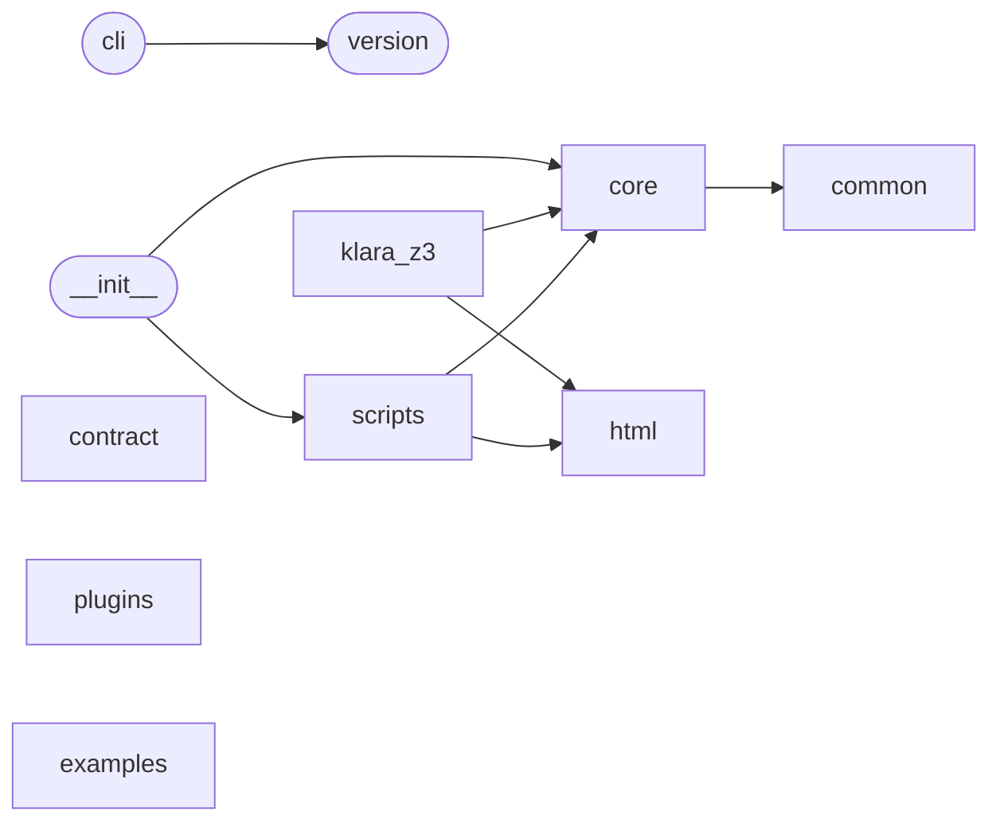

# Code Overview

[_Documentation generated by Documatic_](https://www.documatic.com)

<!---Documatic-section-Codebase Structure Python-start--->
## Codebase Structure Python

The codebase has a 3-deep folder structure,
                with 77 code files in total.

<!---Documatic-block-system_architecture-start--->

<!---Documatic-block-system_architecture-end--->

# #
<!---Documatic-section-Codebase Structure Python-end--->

<!---Documatic-section-Key Objects-start--->
## Key Objects

There are exposed imports at level-0
from the source directory (klara)

<!---Documatic-block-klara-start--->

	
<code>klara</code> (Click to Expand!)

* `klara.core.tree.infer_proxy.InferProxy`
* `klara.core.tree_rewriter.extract_node`
* `klara.scripts.cover_gen_ins.config.ConfigNamespace`

<!---Documatic-block-klara-end--->

# #
<!---Documatic-section-Key Objects-end--->

<!---Documatic-section-Important Functions-start--->
## Important Functions

<!---Documatic-block-important_funcs-start--->
<!---Documatic-block-most_used_funcs-start--->
### Most Utilised Functions

* [klara.html.report.escape](4-klara_html.md#klara.html.report.escape) (2 times)
* [klara.scripts.py_check.result_banner.decorate](6-klara_scripts.md#klara.scripts.py_check.result_banner.decorate) (2 times)
* klara.version.__version__ (1 times)
* [klara.core.tree_rewriter.extract_node](7-klara_core.md#klara.core.tree_rewriter.extract_node) (1 times)
* klara.klara_z3.z3_nodes.handle_z3_exceptions (1 times)
* [klara.core.utilities.methdispatch](7-klara_core.md#klara.core.utilities.methdispatch) (1 times)
* [klara.common.cfg_common.find_blocks_involved](8-klara_common.md#klara.common.cfg_common.find_blocks_involved) (1 times)
* [klara.core.decorators.deprecated](7-klara_core.md#klara.core.decorators.deprecated) (1 times)
* [klara.core.use_def_chain.link_stmts_to_def](7-klara_core.md#klara.core.use_def_chain.link_stmts_to_def) (1 times)
* [klara.core.decorators.cachedproperty](7-klara_core.md#klara.core.decorators.cachedproperty) (1 times)
* [klara.core.protocols.py2_div](7-klara_core.md#klara.core.protocols.py2_div) (1 times)
* [klara.core.source_utils.get_default_stub_files](7-klara_core.md#klara.core.source_utils.get_default_stub_files) (1 times)
* [klara.core.source_utils.get_plugins_files](7-klara_core.md#klara.core.source_utils.get_plugins_files) (1 times)
<!---Documatic-block-most_used_funcs-end--->

<!---Documatic-block-end_user_funcs-start--->
### End User Exposed Functions

* [klara.scripts.cover_gen_ins.config.ConfigNamespace](6-klara_scripts.md#klara.scripts.cover_gen_ins.config.ConfigNamespace)
* [klara.core.tree.infer_proxy.InferProxy](7-klara_core.md#klara.core.tree.infer_proxy.InferProxy)
* [klara.core.tree_rewriter.extract_node](7-klara_core.md#klara.core.tree_rewriter.extract_node)
* klara.__init__.initialize
* klara.__init__.parse
* klara.__init__.parse_node
<!---Documatic-block-end_user_funcs-end--->
<!---Documatic-block-important_funcs-end--->

# #
<!---Documatic-section-Important Functions-end--->

<!---Documatic-section-File IO-start--->
## File IO

<!---Documatic-block-file_io-start--->
The following files have file read operations

<!---Documatic-block-klara.html-start--->

	
<code>klara.html</code> (Click to Expand!)

* klara.html.report

<!---Documatic-block-klara.html-end--->

<!---Documatic-block-klara.plugins-start--->

	
<code>klara.plugins</code> (Click to Expand!)

* klara.plugins.typeshed_stub

<!---Documatic-block-klara.plugins-end--->

The following files have file write operations

<!---Documatic-block-klara.contract-start--->

	
<code>klara.contract</code> (Click to Expand!)

* klara.contract.__main__

<!---Documatic-block-klara.contract-end--->

<!---Documatic-block-klara.html-start--->

	
<code>klara.html</code> (Click to Expand!)

* klara.html.report

<!---Documatic-block-klara.html-end--->
<!---Documatic-block-file_io-end--->

# #
<!---Documatic-section-File IO-end--->

<!---Documatic-section-Class Hierarchy-start--->
## Class Hierarchy

<!---Documatic-block-klara.core.bases.BaseContainer-start--->

	
<code>klara.core.bases.BaseContainer</code> (Click to Expand!)

* klara.core.bases.Sequence
* klara.core.node_classes.Dict

<!---Documatic-block-klara.core.bases.BaseContainer-end--->

<!---Documatic-block-klara.core.bases.BaseInstance-start--->

	
<code>klara.core.bases.BaseInstance</code> (Click to Expand!)

* klara.core.bases.BaseContainer
* klara.core.bases.ClassInstance
* klara.core.node_classes.Const

<!---Documatic-block-klara.core.bases.BaseInstance-end--->

<!---Documatic-block-klara.core.bases.BaseNode-start--->

	
<code>klara.core.bases.BaseNode</code> (Click to Expand!)

* klara.core.bases.BaseContainer
* klara.core.bases.LocalsDictNode
* klara.core.node_classes.Const

<!---Documatic-block-klara.core.bases.BaseNode-end--->

<!---Documatic-block-klara.core.bases.Sequence-start--->

	
<code>klara.core.bases.Sequence</code> (Click to Expand!)

* klara.core.node_classes.List
* klara.core.node_classes.Set
* klara.core.node_classes.Tuple
* klara.core.scoped_node_classes.OverloadedFunc

<!---Documatic-block-klara.core.bases.Sequence-end--->

<!---Documatic-block-klara.core.node_classes.InvertCondMixin-start--->

	
<code>klara.core.node_classes.InvertCondMixin</code> (Click to Expand!)

* klara.core.node_classes.Const
* klara.core.node_classes.Dict
* klara.core.node_classes.List
* klara.core.node_classes.Set
* klara.core.node_classes.Tuple

<!---Documatic-block-klara.core.node_classes.InvertCondMixin-end--->

<!---Documatic-block-klara.core.recipe.ClassInstanceBuilder-start--->

	
<code>klara.core.recipe.ClassInstanceBuilder</code> (Click to Expand!)

* klara.contract.solver.ContractSolver
* klara.scripts.cover_gen_ins.solver.DepFinder
* klara.scripts.py_check.loop_solver.CalledFuncGetter
* klara.scripts.py_check.loop_solver.LoopDetector

<!---Documatic-block-klara.core.recipe.ClassInstanceBuilder-end--->

# #
<!---Documatic-section-Class Hierarchy-end--->

[_Documentation generated by Documatic_](https://www.documatic.com)