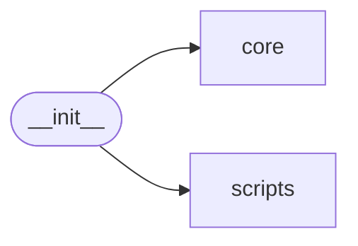

# Klara Init

[_Documentation generated by Documatic_](https://www.documatic.com)

<!---Documatic-section-Codebase Structure-start--->
## Codebase Structure

<!---Documatic-block-system_architecture-start--->

<!---Documatic-block-system_architecture-end--->

# #
<!---Documatic-section-Codebase Structure-end--->

<!---Documatic-section-klara.__init__.initialize-start--->
## klara.__init__.initialize

<!---Documatic-section-initialize-start--->
<!---Documatic-block-klara.__init__.initialize-start--->
<details>
	<summary><code>klara.__init__.initialize</code> code snippet</summary>

```python
def initialize(config: Config=None, smt_disable: bool=False) -> None:
    if smt_disable:
        manager = _core_manager.AstManager()
        manager.initialize(config or Config())
        _infer_extension.disable()
    else:
        MANAGER.initialize(config or Config())
        _infer_extension.enable()
```
</details>
<!---Documatic-block-klara.__init__.initialize-end--->
<!---Documatic-section-initialize-end--->

# #
<!---Documatic-section-klara.__init__.initialize-end--->

<!---Documatic-section-klara.__init__.parse-start--->
## klara.__init__.parse

<!---Documatic-section-parse-start--->
<!---Documatic-block-klara.__init__.parse-start--->
<details>
	<summary><code>klara.__init__.parse</code> code snippet</summary>

```python
def parse(source: str, py2: bool=False) -> Module:
    MANAGER.config.py_version = 2 if py2 else 3
    tree = MANAGER.build_tree(source)
    MANAGER.build_cfg(tree)
    return tree
```
</details>
<!---Documatic-block-klara.__init__.parse-end--->
<!---Documatic-section-parse-end--->

# #
<!---Documatic-section-klara.__init__.parse-end--->

<!---Documatic-section-klara.__init__.parse_node-start--->
## klara.__init__.parse_node

<!---Documatic-section-parse_node-start--->
<!---Documatic-block-klara.__init__.parse_node-start--->
<details>
	<summary><code>klara.__init__.parse_node</code> code snippet</summary>

```python
def parse_node(source: str, py2: bool=False) -> namedtuple:
    MANAGER.config.py_version = 2 if py2 else 3
    MANAGER.reload_protocol()
    (tree, value) = _extract_node(source, py2)
    MANAGER.apply_transform(tree)
    MANAGER.build_cfg(tree)
    return value
```
</details>
<!---Documatic-block-klara.__init__.parse_node-end--->
<!---Documatic-section-parse_node-end--->

# #
<!---Documatic-section-klara.__init__.parse_node-end--->

[_Documentation generated by Documatic_](https://www.documatic.com)