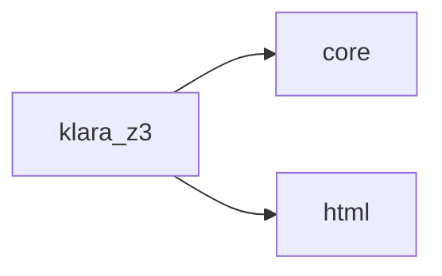

# Klara Klara Z3

[_Documentation generated by Documatic_](https://www.documatic.com)

<!---Documatic-section-Codebase Structure-start--->
## Codebase Structure

<!---Documatic-block-system_architecture-start--->

<!---Documatic-block-system_architecture-end--->

# #
<!---Documatic-section-Codebase Structure-end--->

<!---Documatic-section-klara.klara_z3.z3_nodes.handle_z3_exceptions-start--->
## klara.klara_z3.z3_nodes.handle_z3_exceptions

<!---Documatic-section-handle_z3_exceptions-start--->
<!---Documatic-block-klara.klara_z3.z3_nodes.handle_z3_exceptions-start--->
<details>
	<summary><code>klara.klara_z3.z3_nodes.handle_z3_exceptions</code> code snippet</summary>

```python
def handle_z3_exceptions(f):

    def wrapper(*args, **kwargs):
        try:
            yield from f(*args, **kwargs)
        except z3.Z3Exception:
            yield inference.InferenceResult.load_result(nodes.Uninferable())
    return wrapper
```
</details>
<!---Documatic-block-klara.klara_z3.z3_nodes.handle_z3_exceptions-end--->
<!---Documatic-section-handle_z3_exceptions-end--->

# #
<!---Documatic-section-klara.klara_z3.z3_nodes.handle_z3_exceptions-end--->

[_Documentation generated by Documatic_](https://www.documatic.com)