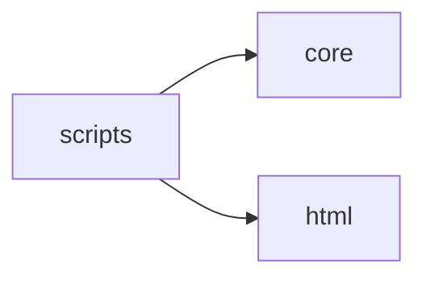

# Klara Scripts

[_Documentation generated by Documatic_](https://www.documatic.com)

<!---Documatic-section-Codebase Structure-start--->
## Codebase Structure

<!---Documatic-block-system_architecture-start--->

<!---Documatic-block-system_architecture-end--->

# #
<!---Documatic-section-Codebase Structure-end--->

<!---Documatic-section-klara.scripts.py_check.result_banner.decorate-start--->
## [klara.scripts.py_check.result_banner.decorate](6-klara_scripts.md#klara.scripts.py_check.result_banner.decorate)

<!---Documatic-section-decorate-start--->
<!---Documatic-block-klara.scripts.py_check.result_banner.decorate-start--->
<details>
	<summary><code>klara.scripts.py_check.result_banner.decorate</code> code snippet</summary>

```python
def decorate(keyword):

    def wrapper(f):

        def _(*args, **kwargs):
            res = f(*args, **kwargs)
            if res:
                res = '\n'.join(('-' * (len(keyword) + 2), '|{}|'.format(keyword), '-' * (len(keyword) + 2), res))
            return res
        return _
    return wrapper
```
</details>
<!---Documatic-block-klara.scripts.py_check.result_banner.decorate-end--->
<!---Documatic-section-decorate-end--->

# #
<!---Documatic-section-klara.scripts.py_check.result_banner.decorate-end--->

<!---Documatic-section-klara.scripts.cover_gen_ins.config.ConfigNamespace-start--->
## [klara.scripts.cover_gen_ins.config.ConfigNamespace](6-klara_scripts.md#klara.scripts.cover_gen_ins.config.ConfigNamespace)

<!---Documatic-section-ConfigNamespace-start--->
<!---Documatic-block-klara.scripts.cover_gen_ins.config.ConfigNamespace-start--->
<details>
	<summary><code>klara.scripts.cover_gen_ins.config.ConfigNamespace</code> code snippet</summary>

```python
class ConfigNamespace(Config):
    file_name: list = []
    force_infer = False
    entry_class: str = ''
    entry_func: str = 'Top'
    output_file = None
    z3_parallel = False
    z3_parallel_max_threads = None
    output_statistics = None
    mss_algorithm = 'z3'
    cover_lines = []
    cover_all = False
    cover_return = False
```
</details>
<!---Documatic-block-klara.scripts.cover_gen_ins.config.ConfigNamespace-end--->
<!---Documatic-section-ConfigNamespace-end--->

# #
<!---Documatic-section-klara.scripts.cover_gen_ins.config.ConfigNamespace-end--->

[_Documentation generated by Documatic_](https://www.documatic.com)