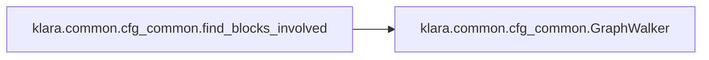

# Klara Common

[_Documentation generated by Documatic_](https://www.documatic.com)

<!---Documatic-section-Codebase Structure-start--->
## Codebase Structure

<!---Documatic-block-system_architecture-start--->
```mermaid
None
```
<!---Documatic-block-system_architecture-end--->

# #
<!---Documatic-section-Codebase Structure-end--->

<!---Documatic-section-klara.common.cfg_common.find_blocks_involved-start--->
## [klara.common.cfg_common.find_blocks_involved](8-klara_common.md#klara.common.cfg_common.find_blocks_involved)

<!---Documatic-section-find_blocks_involved-start--->


### Object Calls

* [klara.common.cfg_common.GraphWalker](8-klara_common.md#klara.common.cfg_common.GraphWalker)

<!---Documatic-block-klara.common.cfg_common.find_blocks_involved-start--->
<details>
	<summary><code>klara.common.cfg_common.find_blocks_involved</code> code snippet</summary>

```python
def find_blocks_involved(root, block_list):
    if root not in block_list:
        block_list.append(root)
    block_involved = []
    for block in GraphWalker(root).walk_bfs():
        block_involved.append(block)
    result = [blk for blk in block_list if blk in block_involved]
    return result
```
</details>
<!---Documatic-block-klara.common.cfg_common.find_blocks_involved-end--->
<!---Documatic-section-find_blocks_involved-end--->

# #
<!---Documatic-section-klara.common.cfg_common.find_blocks_involved-end--->

<!---Documatic-section-klara.common.cfg_common.GraphWalker-start--->
## [klara.common.cfg_common.GraphWalker](8-klara_common.md#klara.common.cfg_common.GraphWalker)

<!---Documatic-section-GraphWalker-start--->
<!---Documatic-block-klara.common.cfg_common.GraphWalker-start--->
<details>
	<summary><code>klara.common.cfg_common.GraphWalker</code> code snippet</summary>

```python
class GraphWalker:

    def __init__(self, root):
        self.root = root
        self._call_str = ''
        self.closed_block = set()
        self.queue = deque()
        self.blocked_by_call_string = dict()
        self.processed_call_string = set()

    def walk_bfs(self):
        if not self.root:
            return
        self.queue.append(self.root)
        for block in self._walk_bfs():
            yield block

    def _walk_bfs(self):
        while len(self.queue) != 0:
            block = self.queue.popleft()
            if block:
                yield block
                for nxt_blk in block.nxt_block_list:
                    if nxt_blk not in self.queue and nxt_blk not in self.closed_block:
                        self.queue.append(nxt_blk)
                self.closed_block.add(block)

    def walk_dfs(self):
        walk_record = []
        for block in self._walk_dfs(walk_record, self.root):
            yield block

    def _walk_dfs(self, walk_record, basic_block):
        """
        yield nodes from bottom
        :return:
        """
        if basic_block is None:
            return
        walk_record.append(basic_block)
        for next_block in basic_block.nxt_block_list:
            if next_block not in walk_record and next_block is not None:
                for block in self._walk_dfs(walk_record, next_block):
                    yield block
        for block in reversed(self.queue):
            if block not in walk_record and block is not None:
                for block in self._walk_dfs(walk_record, block):
                    yield block
        yield basic_block
```
</details>
<!---Documatic-block-klara.common.cfg_common.GraphWalker-end--->
<!---Documatic-section-GraphWalker-end--->

# #
<!---Documatic-section-klara.common.cfg_common.GraphWalker-end--->

[_Documentation generated by Documatic_](https://www.documatic.com)